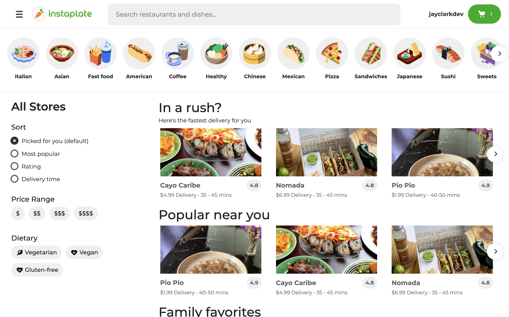

# Instaplate

## THE INSTACART RESTAURANT DELIVERY CLONE



Have you ever wondered what it would look like if Instacart got into the restaurant delivery business, while simultaneously ripping off UberEats's UI? Look no further, my friends.

Instaplate is a full-stack demo web app where you can:

- Browse, sort, search, and filter restaurants
- Browse and search dishes
- Add, remove, and adjust the quantity of dishes to your shopping cart
- Checkout using Stripe's test card credentials
- Register and login using email or your Google account

The front end is built with React and Typescript, and uses minimal libraries to achieve complex CSS animations that interact with state, such as the menu/login/register drawer opening and closing behavior.

See it in action at [instaplate.herokuapp.com](http://instaplate.herokuapp.com)!

For the backend, visit the [instaplate-backend](https://github.com/jayeclark/instaplate-backend) repository.

## Developing

### Install Locally Using Docker

1. Clone the repository.
2. Make sure you have Docker installed and that it is running in the background
3. Copy the .env.example file (remove the .example) and enter values for the private keys
4. Run ```docker build .```
5. Run the container after it is finished building

### Install Locally Using NPM

1. Clone the repository.
2. Make sure you are using Node 14 or 12. (Project may break on 16 or 17)
3. Run ```npm install``` to install dependencies.
4. After npm has finished installing, run ``npm run -p 3000`` to start the development server
